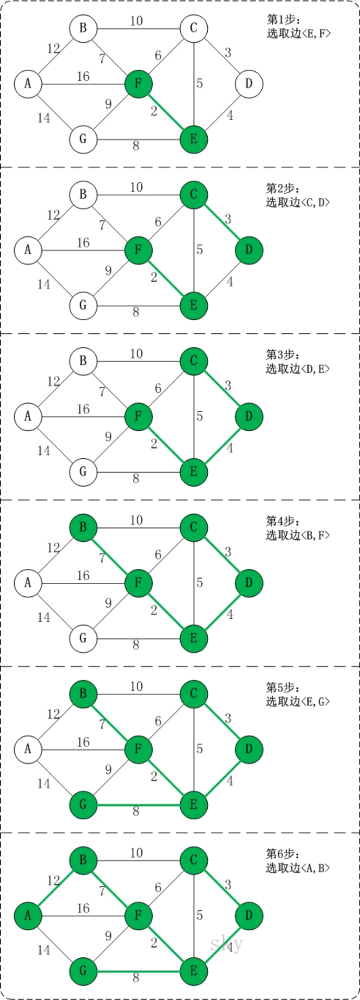

# 算法

## 图的算法

### 最小生成树算法

#### prim算法

假设K为图的顶点个数，则边的数量为K-1。

生成一个数组记录该顶点是否已添加。

prim算法关键步骤：

1.K-1次循环生成图的边。

#### Kruskal算法

EData的表示：

```java
class EData() {
    private char start;
    private char end;
    private int weight;

    EData(char start, char end, int weight) {
        this.start = start;
        this.end = end;
        this.weight = weight;
    }
}
```

Kruskal算法关键步骤：在邻接矩阵表示图的情况下

1.获取对应的Matrix[][]邻接数组和Vertexs[]顶点数组以及边的个数，然后构造对应的Kruskal构造函数。

2.在邻接矩阵的条件下遍历所有存在的边，并存为EData[]

3.对EData素组进行遍历，将数组中的所有边按照weight从小到大排序。

4.对于排序后的EData数组进行遍历，并按照Kruskal算法的原则即加入树中的所有EData均不能构成回路进行筛选后存入相应的数组。

```java
class Kruskal {
    private int[] ends = new int[Vertexs.length-1];
    private EData[] res = new EData[Vertexs.length-1]
    private int index = 0;
    public void kruskal() {
        for (int i = 0; i < EData.length; i++) {
            //边的起点位置
            int p1 = getPosition(EData[i].start);
            //边的终点位置
            int p2 = getPosition(EData[i].end);
            //获取顶点对应的终点
            int m = getEnd(ends, p1);
            int n = getEnd(ends, p2);
            
            if (m != n){
                ends[m] = n;
                res[index++] = EData[i];
            }
        }
        for (int i = 0; i < index; i++){
            //输出最后排序的最小生成树
            System.out.println(res[i]);
        }
    }

    public int getEnd(int[] ends, int i) {
        while (ends[i] != 0) {
            i = ends[i];
        }
        return i;
    }
}
```
图解算法如下图：



